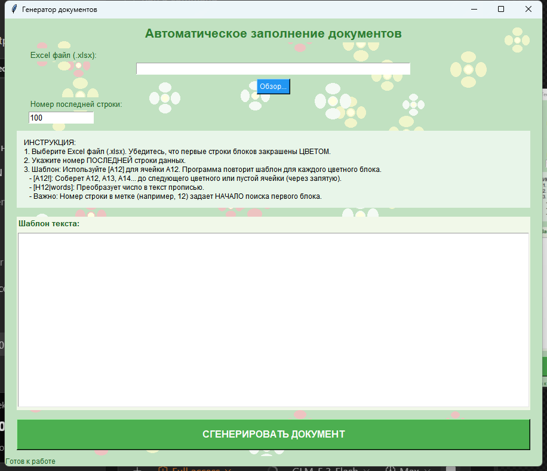

# Генератор документов

Программа для автоматического создания юридических и бухгалтерских документов (актов сверки, соглашений о взаимозачете, претензий) на основе данных из таблиц Excel. Инструмент предназначен для бухгалтеров, экономистов и юристов, позволяя исключить ошибки ручного ввода и сократить время подготовки документов с часов до минут.



## Основные возможности

*   **Автоматическая подстановка данных:** Заполнение шаблонов данными из Excel по умным меткам.
*   **Суммы прописью:** Автоматическое преобразование числовых значений в текст на русском языке с правильным склонением.
*   **Группировка списков:** Возможность объединять перечни документов (накладных, счетов) из нескольких строк таблицы в один абзац через запятую.
*   **Фильтрация пустых данных:** Автоматический пропуск блоков, в которых отсутствуют необходимые данные, что предотвращает создание некорректных документов.
*   **Интуитивный интерфейс:** Простое управление без необходимости знания программирования.
*   **Поддержка 1С:** Идеально работает с выгрузками из систем 1С:Предприятие после минимальной подготовки.

---

## Интеграция с 1С и другими учетными системами

Программа не требует прямого подключения к базам данных. Работа строится по принципу «Выгрузка — Подготовка — Генерация»:

1.  **Выгрузка:** Сформируйте в 1С отчет (например, «Акт сверки», «Оборотно-сальдовая ведомость») и сохраните его в формате Excel (`.xlsx`).
2.  **Подготовка:** Откройте файл в Excel. Закрасьте цветом ячейки в тех строках, которые должны стать заголовками новых документов (например, строки с названием контрагента). Строки без заливки, идущие следом, будут считаться детализацией этого документа.
3.  **Генерация:** Загрузите файл в программу, укажите шаблон и получите готовые документы.

Этот подход универсален для любых конфигураций 1С (Бухгалтерия, Управление торговлей, ЗУП и др.).

---

## Системные требования

*   **ОС:** Windows 7, 8, 10, 11.
*   **Для запуска .exe версии:** Дополнительные компоненты не требуются.
*   **Для запуска из исходного кода:**
    *   Python 3.6+
    *   Библиотеки: `pandas`, `openpyxl`, `python-docx`, `Pillow`, `tkinter`.
*   **Редактор таблиц:** Microsoft Excel, WPS Office или LibreOffice (для подготовки входных файлов и работы с цветами ячеек).

---

## Установка

### Вариант 1: Готовое приложение (.exe)
1.  Скопируйте файл `DocGenerator.exe` в любую папку.
2.  Запустите двойным кликом. Установка дополнительных программ не требуется.

### Вариант 2: Запуск из исходного кода
1.  Установите Python с официального сайта.
2.  Откройте терминал (cmd) и установите зависимости:
    ```bash
    pip install pandas openpyxl python-docx Pillow
    ```
3.  Запустите программу:
    ```bash
    python debt_doc_automator.py
    ```

---

## Инструкция по использованию

### Шаг 1. Подготовка файла Excel
Откройте вашу таблицу. Для корректной работы важно соблюдать правило форматирования:
*   **Залитая цветом ячейка** = Начало нового документа (блока).
*   **Ячейка без заливки** = Продолжение текущего документа (детализация, список документов).
*   Файл должен быть сохранен в формате **.xlsx**.

### Шаг 2. Настройка программы
1.  Нажмите кнопку **«Обзор...»** и выберите ваш файл Excel.
2.  В поле **«Номер последней строки»** укажите номер последней строки с данными в таблице.

### Шаг 3. Создание шаблона
В текстовое поле вставьте текст вашего будущего документа. Используйте специальные метки для подстановки данных:

| Метка | Описание | Пример использования |
| :--- | :--- | :--- |
| `[A12]` | Подставляет данные из столбца A. Номер строки (12) указывает на позицию начала первого блока. Для следующих блоков программа автоматически определит нужную строку. | Контрагент: `[B12]` |
| `[H12\|words]` | Подставляет сумму прописью. | Сумма: `[H12\|words]` |
| `[A12!]` | Собирает данные из столбца A подряд (A12, A13, A14...) до конца блока и объединяет их через запятую. | Документы: `[A12!]` |

> **Пример шаблона:**
> ```text
> Акт сверки с контрагентом [B12]
> Договор № [D12] от [E12]
> 
> Основание: [A12!]
> Итого сумма: [H12|words] ([H12] руб.)
> ```

### Шаг 4. Генерация и сохранение
1.  Нажмите кнопку **«СГЕНЕРИРОВАТЬ ДОКУМЕНТ»**.
    *   *Примечание:* Если в каком-то блоке не хватит данных для заполнения всех меток, этот блок будет автоматически пропущен.
2.  В окне сохранения выберите формат:
    *   **Word Document (*.docx)** — рекомендуется для печати и редактирования.
    *   **Text File (*.txt)** — простой текст.
3.  После сохранения вы увидите сообщение с количеством созданных документов.

---

## Устранение неполадок

| Проблема | Возможная причина и решение |
| :--- | :--- |
| **«Нет данных» или пустой файл** | 1. Не закрашены ячейки-заголовки в Excel.<br>2. Неверно указан номер последней строки.<br>3. В шаблоне есть метки, ведущие на пустые ячейки. |
| **Сумма прописью неверна** | В Excel ячейка имеет текстовый формат. Измените его на числовой. |
| **Список `[A12!]` обрывается** | Внутри списка есть пустая строка или следующая цветная строка началась раньше времени. Проверьте сплошность данных. |
| **Не работает Ctrl+V** | Нажмите **правую кнопку мыши** в поле шаблона и выберите «Вставить» из контекстного меню. |

---

## Меры предосторожности

*   **Тестирование:** Перед генерацией большого объема документов проверьте шаблон на 3-5 строках.
*   **Проверка результата:** Всегда визуально проверяйте сгенерированные файлы перед отправкой.
*   **Безопасность данных:** Программа работает только на чтение исходного Excel-файла и не изменяет его. Тем не менее, рекомендуется регулярно создавать резервные копии ваших таблиц.

---

## Техническая поддержка

Программа является автономным инструментом. Для внесения изменений в логику работы (склонение слов, форматы дат, сложные условия) требуется доработка исходного кода специалистом по Python.